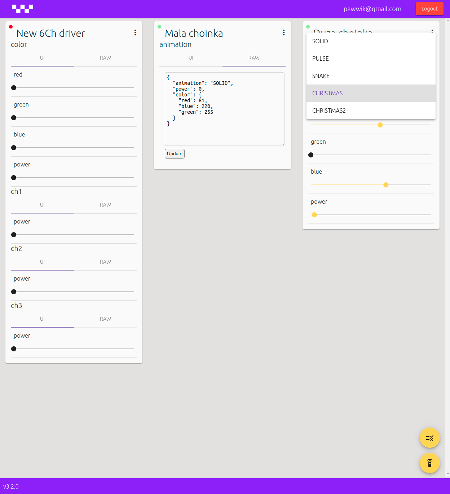

# IotDash

This project contains repository for iot dashboard, angular application for controlling iot devices. This is a part of an ng-iot project. For more apps see:

- Common library used in all JS projects - https://github.com/pwiklowski/lib-ng-iot
- Core of iot solution, handles all connections form devices and controllers - https://github.com/pwiklowski/ng-iot-gateway
- Common library used in all C projects - https://github.com/pwiklowski/ng-iot-esp-idf-library
- Esp32 firmware for PWM led drivers - https://github.com/pwiklowski/ng-iot-esp32-rgb-led-driver
- Esp32 firmware for addressable led strips - https://github.com/pwiklowski/ng-iot-esp32-ws2812
- Node application for iot<->Zigbee adapter - https://github.com/pwiklowski/ng-iot-router-box

# Screenshots

### Rule editor

### Device list

### Device config preview

## Demo

https://youtu.be/3aviC4TlLGU

# Devices

### 3 Channel PWM led driver

### 6 Channel PWM led driver

### Christmas tree XS

### Christmas tree L

## Development server

Run `ng serve` for a dev server. Navigate to `http://localhost:4200/`. The app will automatically reload if you change any of the source files.

## Code scaffolding

Run `ng generate component component-name` to generate a new component. You can also use `ng generate directive|pipe|service|class|guard|interface|enum|module`.

## Build

Run `ng build` to build the project. The build artifacts will be stored in the `dist/` directory. Use the `--prod` flag for a production build.

## Running unit tests

Run `ng test` to execute the unit tests via [Karma](https://karma-runner.github.io).

## Running end-to-end tests

Run `ng e2e` to execute the end-to-end tests via [Protractor](http://www.protractortest.org/).

## Further help

To get more help on the Angular CLI use `ng help` or go check out the [Angular CLI README](https://github.com/angular/angular-cli/blob/master/README.md).
